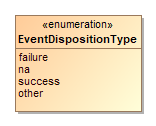
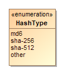
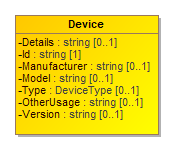
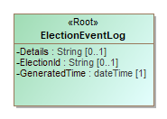
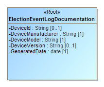
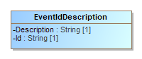

# EventLoggingV1

- Table of Contents
  - Enumerations
    - *The **[DeviceType](#_18_2_43401a7_1448918170138_736592_4366)** Enumeration*
    - *The **[EventDispositionType](#_17_0_2_4_f71035d_1448386251626_459706_2440)** Enumeration*
    - *The **[HashType](#_19_0_43701b0_1551277104966_589263_4727)** Enumeration*
  - Classes
    - *The **[Device](#_18_2_43401a7_1458836797652_566165_4461)** Class*
    - *The **[ElectionEventLog](#_16_9_c0802fe_1373998775830_299520_2116)** Class*
    - *The **[ElectionEventLogDocumentation](#_19_0_43701b0_1551892560159_591563_4768)** Class*
    - *The **[Event](#_16_9_c0802fe_1373996817517_272063_1501)** Class*
    - *The **[EventIdDescription](#_19_0_43701b0_1551892560160_504752_4769)** Class*
    - *The **[EventTypeDescription](#_19_0_43701b0_1551892560160_283613_4770)** Class*

## Enumerations

### *The **DeviceType** Enumeration*

Used in [Device](#_18_2_43401a7_1458836797652_566165_4461)::[Type](#_18_2_43401a7_1458837190975_379280_4518) to describe the type or usage of the device generating the event.

Name | Value
---- | -----
`adjudication`|Electronic adjudication function for reviewing absentee/mail-in ballots anomalies (blanks/overvotes/write-ins/unreadable ballots).
`ballot-activation`|Devices for enabling a vote capture device (VCD) to display a ballot, possibly directly connected to the VCD or through a smart card interface.
`bmd`|Ballot marking devices (voter facing).
`ballot-printing`|Marked ballot printing devices (voter facing).
`blank-ballot-printing`|On-demand blank ballot printers.
`dre`|Electronic voter stations, standalone or daisy chained to a DRE-controller (voter facing).
`dre-controller`|Network controller for electronic voting (poll worker facing).
`electronic-cast`|DREs, or other devices that store cast vote records electronically (voter facing).
`electronic-cast-paper`|DREs, or devices that store cast vote records electronically and also print a paper record (voter facing).
`electronic-poll-book`|Electronic poll book devices.
`ems`|Election management systems, including for pre- and post-election administration and reporting functions.
`scan-batch`|Scanning devices for batches of ballots, auto-feeding, e.g., Central Count (poll worker facing).
`scan-single`|Scanning devices for single-sheets, e.g., Precinct Count (voter facing), but could be used for Central Count by an election official.
`transmission-sending`|Remote transmission clients, e.g., for sending of unofficial results from a remote location to a central location (sending station).
`transmission-receiving`|Remote transmission hosts, e.g., for the receiving of unofficial results at a central location from a remote location (receiving station).
`other`|Used when no other value in this enumeration applies.

### *The **EventDispositionType** Enumeration*

Used in [Event](#_16_9_c0802fe_1373996817517_272063_1501)::[Disposition](#_16_9_f2e0365_1375898006411_547543_2341) for types of event dispositions.

Name | Value
---- | -----
`failure`|For a failure disposition.
`na`|Used when the disposition is not applicable or there is no disposition.
`success`|For a successful disposition.
`other`|Used when no other value in this enumeration applies.

### *The **HashType** Enumeration*

Used in [Hash](#_18_0_2_6340208_1485894593826_736413_4615)::[Type](#_18_0_2_6340208_1485894641846_811323_4646) to indicate the type of hash being used for an image file.

Name | Value
---- | -----
`md6`|To indicate that the MD6 message digest algorithm is being used.
`sha-256`|To indicate that the SHA 256-bit signature is being used.
`sha-512`|To indicate that the SHA 512-bit (32-byte) signature is being used.
`other`|Used when no other value in this enumeration applies.

## Classes

### *The **Device** Class*

Device contains information about the device generating election event logs. [Id](#_16_9_f2e0365_1375898077639_261665_2348) is the only required attribute, all other attributes are optional. If the device type is not found in the [DeviceType](#_18_2_43401a7_1448918170138_736592_4366) enumeration, Type is ‘other’ and [OtherType](#_18_2_43401a7_1448918045388_252688_4353) contains the appropriate type.

Attribute | Multiplicity | Type | Attribute Description
--------- | ------------ | ---- | ---------------------
`Details`|0..1|`String`|Used to associate any details with the event log.
`{Event}`|0..*|`Event`|Used to describe a logged event.
`HashType`|0..1|`HashType`|The type of the hash, from the [HashType](#_19_0_43701b0_1551277104966_589263_4727) enumeration.
`OtherHashType`|0..1|`String`|If [HashType](#_19_0_43701b0_1551362077643_666577_6063) is 'other', the type of the hash.
`Id`|1|`String`|A serial number or otherwise identifier associated with the device.
`Manufacturer`|0..1|`String`|Manufacturer of the device.
`Model`|0..1|`String`|Model of the device.
`Type`|0..1|`DeviceType`|Enumerated usage of the device, e.g., ems, scan-single, etc.
`OtherType`|0..1|`String`|Used when [Type](#_18_2_43401a7_1458837190975_379280_4518) is ‘other’.
`Version`|0..1|`String`|Version identification of the device.

### *The **ElectionEventLog** Class*

ElectionEventLog is the root class. It includes [Device](#_18_2_43401a7_1458836797652_566165_4461) for identifying the device(s) generating the election events, the date and time when the election event log was created, and an identification of the election. [Details](#_18_2_43401a7_1458825227267_28946_4470) is used as needed for additional description/details. [HashType](#_19_0_43701b0_1551362077643_666577_6063) is used to specify a cryptographic hash associated with the events, that is, an event log entry, using values from the [HashType](#_19_0_43701b0_1551277104966_589263_4727) enumeration. If the type of hash is not found in the [HashType](#_19_0_43701b0_1551277104966_589263_4727) enumeration, [HashType](#_19_0_43701b0_1551277104966_589263_4727) is ‘other’ and [OtherHashType](#_19_0_43701b0_1551362095000_687582_6067) contains the type of hash.

Attribute | Multiplicity | Type | Attribute Description
--------- | ------------ | ---- | ---------------------
`Details`|0..1|`String`|Used to associate any details with the event log.
`{Device}`|0..*|`Device`|Used to describe the device(s) generating the election events.
`ElectionId`|0..1|`String`|Identifies the election associated with the log.
`GeneratedTime`|1|`dateTime`|Identifies the date and time the log was generated.

### *The **ElectionEventLogDocumentation** Class*

ElectionEventLogDocumention is the root class. It includes [EventIdDescription](#_19_0_43701b0_1551892560160_504752_4769) and [EventTypeDescription](#_19_0_43701b0_1551892560160_283613_4770), as well as other information for identifying the specific device associated with the election event documentation.

Attribute | Multiplicity | Type | Attribute Description
--------- | ------------ | ---- | ---------------------
`DeviceId`|0..1|`String`|A serial number or otherwise identifier associated with the device.
`DeviceManufacturer`|1|`String`|Manufacturer of the device.
`DeviceModel`|1|`String`|Model of the device.
`DeviceVersion`|0..1|`String`|Version identification of the device.
`{EventIdDescription}`|1..*|`EventIdDescription`|For associating a description with an event ID.
`{EventTypeDescription}`|1..*|`EventTypeDescription`|For associating a description with an event type.
`GeneratedDate`|1|`date`|Identifies the date the documentation report was generated.

### *The **Event** Class*

Event holds information about a specific event. [Severity](#_16_9_f2e0365_1375897866132_94017_2339) is an optional attribute for describing a severity indication for the event. If the event disposition is not found in the [EventDispositionType](#_17_0_2_4_f71035d_1448386251626_459706_2440) enumeration, [Disposition](#_16_9_f2e0365_1375898006411_547543_2341) is ‘other’ and [OtherDisposition](#_17_0_2_4_f71035d_1448386350889_251652_2466) contains the other disposition.

Attribute | Multiplicity | Type | Attribute Description
--------- | ------------ | ---- | ---------------------
`Description`|0..1|`String`|Used for a brief description of the event.
`Details`|0..1|`String`|Used for additional information about the event, e.g., vendor reserved information.
`Disposition`|1|`EventDispositionType`|The disposition, e.g., success or failure, of the event.
`OtherDisposition`|0..1|`String`|Used when [Disposition](#_16_9_f2e0365_1375898006411_547543_2341) is ‘other’.
`Hash`|0..1|`String`|Contains a cryptographic hash of the event, encoded as a string.
`Id`|1|`String`|An identifier associated with the event.
`Sequence`|1|`String`|A sequence number/string to uniquely identify the event in the log file.
`Severity`|0..1|`String`|Used for an indication of the severity of the event, as determined by the device vendor.
`TimeStamp`|1|`dateTime`|Identifies the date and time the event was generated.
`Type`|1|`String`|Used for the type of event, as determined by the device vendor.
`UserId`|0..1|`String`|An identifier associated with a user, as relevant.

### *The **EventIdDescription** Class*

For associating a brief description with an election event ID, used in [ElectionEventLogDocumentation](#_19_0_43701b0_1551892560159_591563_4768)::[EventIdDescription](#_19_0_43701b0_1551892560168_64794_4775).

Attribute | Multiplicity | Type | Attribute Description
--------- | ------------ | ---- | ---------------------
`Description`|1|`String`|Used for a brief description of the event.
`Id`|1|`String`|An identifier associated with the event.

### *The **EventTypeDescription** Class*

For associating a description with an election event log type, used in [ElectionEventLogDocumentation](#_19_0_43701b0_1551892560159_591563_4768)::EventTypeDescription.

Attribute | Multiplicity | Type | Attribute Description
--------- | ------------ | ---- | ---------------------
`Description`|1|`String`|Used for a description of the event type.
`Type`|1|`String`|An identifier associated with the event type.

