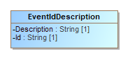
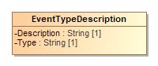

# EventLoggingDocumentationV1-8

- Table of Contents
  - Enumerations
  - Classes
    - *The **[ElectionEventLogDocumentation](#_16_9_c0802fe_1373998775830_299520_2116)** Class*
    - *The **[EventIdDescription](#_16_9_c0802fe_1373996817517_272063_1501)** Class*
    - *The **[EventTypeDescription](#_18_2_43401a7_1459795591545_309185_4461)** Class*

## Enumerations

## Classes

### *The **ElectionEventLogDocumentation** Class*

ElectionEventLogDocumention is the root class. It includes [EventIdDescription](#_16_9_c0802fe_1373996817517_272063_1501) and [EventTypeDescription](#_18_2_43401a7_1459795591545_309185_4461), as well as other information for identifying the specific device associated with the election event documentation.

Attribute | Multiplicity | Type | Attribute Description
--------- | ------------ | ---- | ---------------------
`DeviceId`|0..1|`String`|A serial number or otherwise identifier associated with the device.
`DeviceManufacturer`|1|`String`|Manufacturer of the device.
`DeviceModel`|1|`String`|Model of the device.
`DeviceVersion`|0..1|`String`|Version identification of the device.
`EventIdDescription`|1..*|`EventIdDescription`|For associating a description with an event ID.
`EventTypeDescription`|1..*|`EventTypeDescription`|For associating a description with an event type.
`GeneratedDate`|1|`date`|Identifies the date the documentation report was generated.

### *The **EventIdDescription** Class*

For associating a brief description with an election event ID, used in [ElectionEventLogDocumentation](#_16_9_c0802fe_1373998775830_299520_2116)::[EventIdDescription](#_16_9_c0802fe_1374064398579_889747_1879).

Attribute | Multiplicity | Type | Attribute Description
--------- | ------------ | ---- | ---------------------
`Description`|1|`String`|Used for a brief description of the event.
`Id`|1|`String`|An identifier associated with the event.

### *The **EventTypeDescription** Class*

For associating a description with an election event log type, used in [ElectionEventLogDocumentation](#_16_9_c0802fe_1373998775830_299520_2116)::EventTypeDescription.

Attribute | Multiplicity | Type | Attribute Description
--------- | ------------ | ---- | ---------------------
`Description`|1|`String`|Used for a description of the event type.
`Type`|1|`String`|An identifier associated with the event type.

